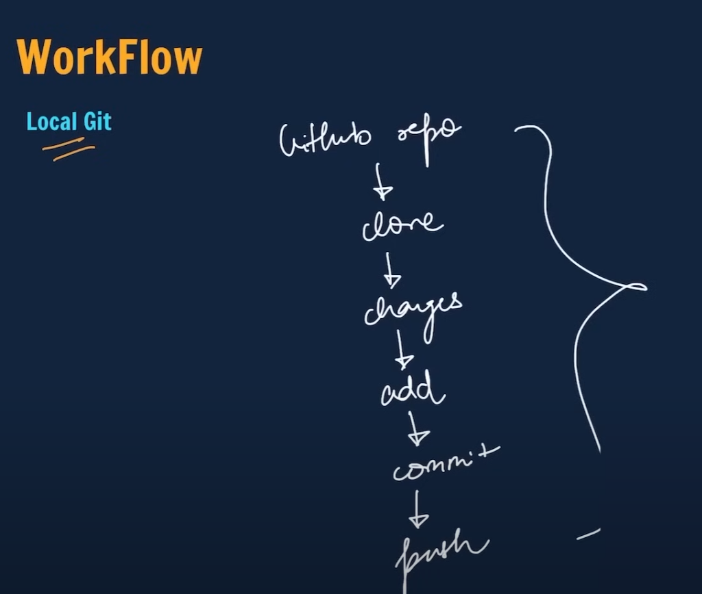

# Testing local repo for the second time since I am a dummy and didn't get it the first time.

git add . <add all the new changes/files>
git commit -m "message you wanna add to this update"
git push <push everything to github>

git branch <to check which branch you are in>
git branch -M <new branch name> <to rename the branch>
git checkout -b <new branch name>
git checkout <brand name you want to switch to>
git brand -d <branch name you want to delete>